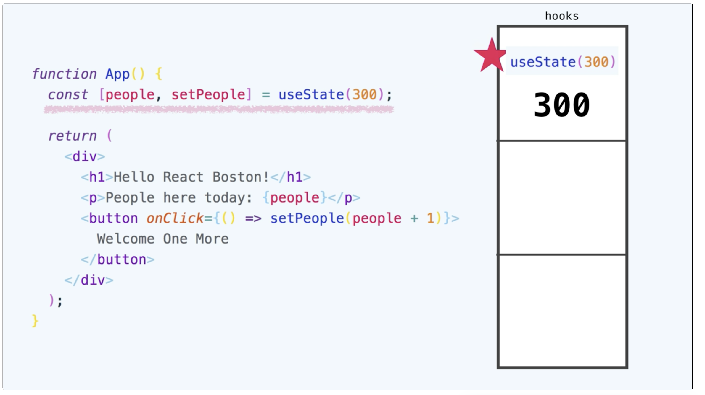

David Ceddia's [Pure React](https://purereact.com/)  course contains self-paced React workshops, the pure react book, and access to previous live events David has taught. There are also future modules coming to the course, such as an Async React with Suspense modules. I thought the course was excellent and well worth the investment. Below are some of my notes on a few things I learned from the course.

## 1. How hooks work under the hood.



Before React calls this component, it creates an array of hooks that lives alongside this component instance. React keeps an index into this array. It starts of at 0. Every time you call a hook, it occupies the first slot with whatever you passed in as the default. In this case it's at 300. So the call to useState occupies the first slot with 300 in it. Then the index moves to the next slot, looking for the next hook.

This is how hooks are able to retain state between renders, and understanding this helped me better realize why we need the rules of hooks, which are:

1. Only call hooks at the top level of your function. Don’t put them in loops, conditionals, or nested functions. This is how React can properly keep track of your hooks.

2. Only call hooks from React function components, or from custom hooks. Don’t call them from outside a component.

3. The names of hooks must start with “use”. 

## 2. Optimizing a React Component with shouldComponentUpdate.

A React component primarily renders for 2 reasons: either its state changes, or its parent told it to re-render. We can use the `componentShouldUpdate` lifecycle method to keep track of 

These are just a few things I learned from course, and you can view the full [curriculum](https://purereact.com/).

## 3. Developing declarative thinking.

In React, it's helpul to think declaratively, rather than imperatively. Simple example of the declarative React way of thinking. 

```jsx
<Accordion isOpen={true}/> 
function hi()
// or
<Accordion isOpen={false}/>
```

Before using React, we might think about opening and closing an accordion by clicking on a toggle button. The Accordion knows if it is open or closed. With React, thinking declaratively, the Accordion is displayed in either an open or closed state and this info is stored as a flag inside the parent's component state, not the Accordion. The Accordion is *told* to open or closed by what is rendering it.